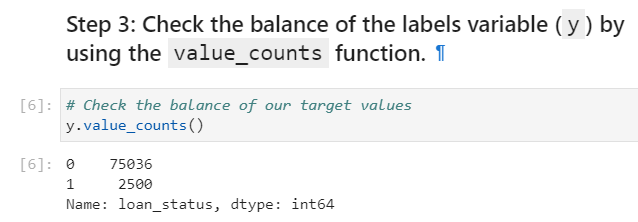
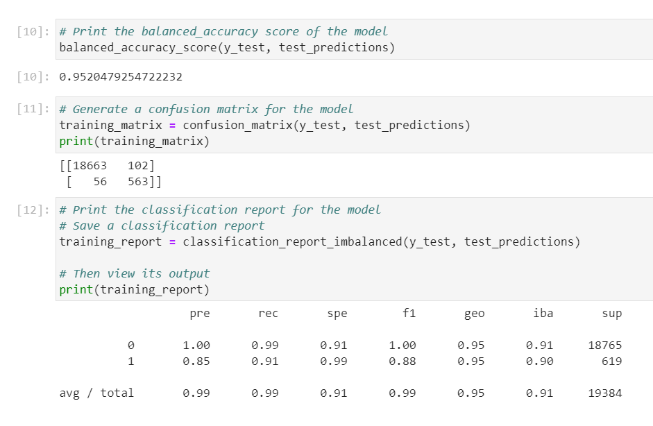
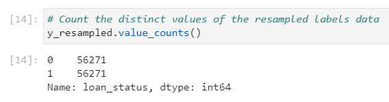
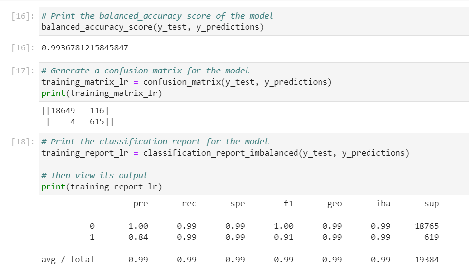

## Challenge_12

In this program, I've used various techniques to train and evaluate models with imbalanced classes. You’ll use a dataset of historical lending activity from a peer-to-peer lending services company to build a model that can identify the creditworthiness of borrowers. You will be able to use a logistic regression model to compare two versions of the dataset, original and resampled. 

---

## Technologies

https://scikit-learn.org/stable/modules/generated/sklearn.linear_model.LogisticRegression.html

This project leverages python 3.7, imbalanced-learn and PyDotPlus libraries. You will install Install imbalanced-learn and PyDotPlus by installing in your conda dev environment in your terminal.

conda install -c conda-forge imbalanced-learn
conda install -c conda-forge pydotplus

---

## Usage

To use this application simply clone the repository and run credit_risk_resampling.ipynb on your Jupyter Notebook.

---

## Sample Visualization and Metrics

Value Counts for original dataset...

Balance Accuracy, Confision Matrix & Classification Report of original dataset

Value Counts for resampled dataset...

Balance Accuracy, Confision Matrix & Classification Report of Resampled dataset

---

## Contributors

linkedin.com/in/john-sung-3675569

---

## License

MIT

---