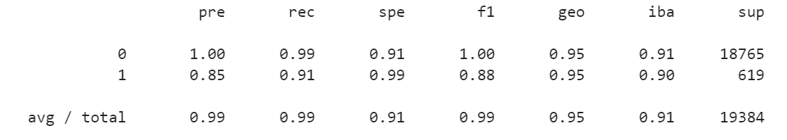
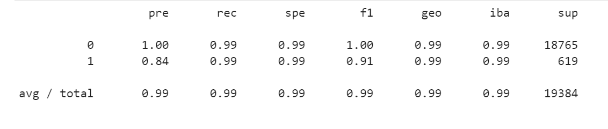

# Module 12 Report Template

## Overview of the Analysis

* Explain the purpose of the analysis.
The purpose of this analysis was to evaluate whether the imbalanced data or resampled data used in the logistic regression model was more effective in identifying high-risk loans with the poterntial to default.

* Explain what financial information the data was on, and what you needed to predict.
The lending_data.csv file provided 77536 count of borrower information that included loan size, interest rate, borrower income, number of accounts, derogatory marks, total debt and loan status. From this data, we are attempting to predict the likelihood of the borrower defaulting. However, you'll notice an imbalance of the creditworthy loans versus high risk loans. 

* Provide basic information about the variables you were trying to predict (e.g., `value_counts`). 
The initial goal was to separate the labels from the features by assigning y to the labels and X to the features from the data frame created by the information inside the csv file. The value_counts function was used to provide a numerical value to the credit worthiness of the borrowers with the assigned integer of 0 (75036 of healthy loans) and 1 (2500 count of high risk).

* Describe the stages of the machine learning process you went through as part of this analysis.
I split the data into training and testing datasets using train_test_split. I fit the logistic regression model by using the training data X_train and y_train. 

* Briefly touch on any methods you used (e.g., `LogisticRegression`, or any resampling method).
LogisticRegression was run for both the original data and the resampled data. The original data included an imbalanced data set. By using the resampling method, the value count were resampled to reflect 56271 for both healthy loans and high risk loans from 75036 for healthy loans 2500 count of high risk loans respectively. 
 
## Results

Using bulleted lists, describe the balanced accuracy scores and the precision and recall scores of all machine learning models.

* Machine Learning Model 1:
    * Description of Model 1 Accuracy, Precision, and Recall scores.
    - Model 1 had a balance accuracy score of 0.95, which is relatively high. 
    - As mentioned earlier in this report, `value_counts` function dictates an imbalance between loan status of  0 (75036 of healthy loans) and 1 (2500 count of high risk). 
    - While the precision was 1.00 for healthy loans, the precision was 0.85 for the high risk loans. Looking further along the data, you see that the recall was 0.99 and 0.91 respectively.   

    
        
* Machine Learning Model 2:
    * Description of Model 2 Accuracy, Precision, and Recall scores. 
    - By using the RandomOverSampler module to resample the data, Model 2 had a balance accuracy score improves to 0.99. 
    - While the precision of the healthy loans remains 100%, the initial imblance is corrected by this test where the valaue counts of y-resamppled is 56271 for 0 (healthy loans) and 1 (high risk loans). 

    

* Summarize the results of the machine learning models, and include a recommendation on the model to use, if any. For example:
* Which one seems to perform best? How do you know it performs best?
* Does performance depend on the problem we are trying to solve? (For example, is it more important to predict the `1`'s, or predict the `0`'s? )

    - After carefully evaluating the machine learning models, I recommend that the resampled data be used for identifying high risk loans. Approximately 99% of the transactions in the test data were accurately categorized by the model. The accuracy score improves for the resampled data (0.99 vs 0.95), meaning that the model using resampled data was better at detecting true positives and true negatives. The precision for the minority class is slightly higher with the orignal data (0.85) versus the resampled data (0.84) meaning that the original data was better at detecting the users that were actually going to default. As we evaluate the recall, the minority class metric using resampled data was clearly better (0.99 vs 0.91) meaning that the resampled data correctly clasified a higher percentage of the truly defaulting borrowers. Although either model portrays the healthy loans equally well, the model using resampled data was much better at detecting borrowers who are likely to default than the model generated using the original, imbalanced dataset.
